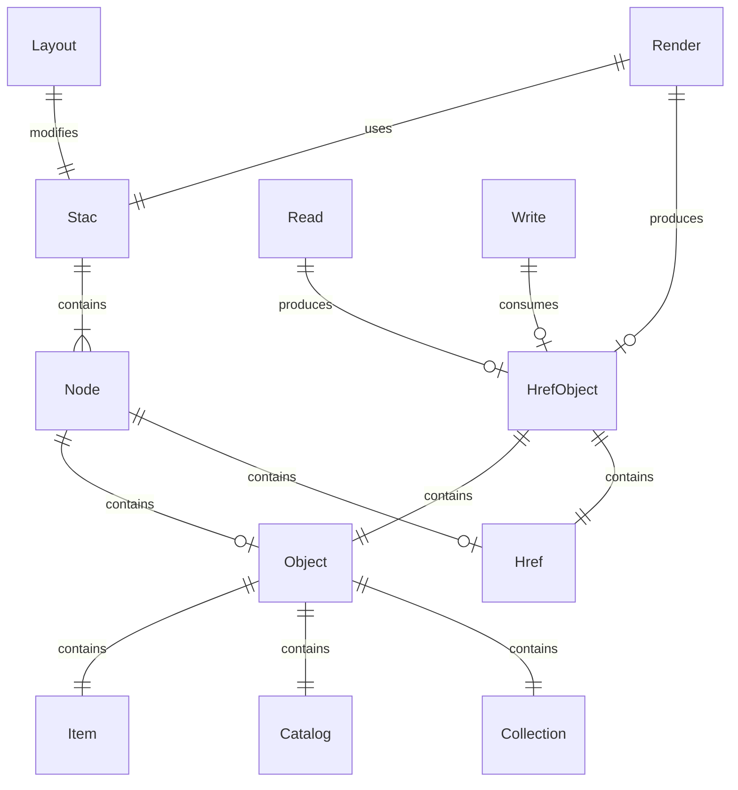

# stac-rs architecture

```mermaid
erDiagram
    Object ||--|| Item : contains
    Object ||--|| Catalog : contains
    Object ||--|| Collection : contains
    HrefObject ||--|| Object : contains
    HrefObject ||--|| Href : contains
    Stac ||--|{ Node : contains
    Node ||--o| Object : contains
    Node ||--o| Href : contains
    Read ||--o| HrefObject : produces
    Write ||--o| HrefObject : consumes
    Layout ||--|| Stac : modifies
    Render ||--|| Stac : uses
    Render ||--o| HrefObject: produces
```