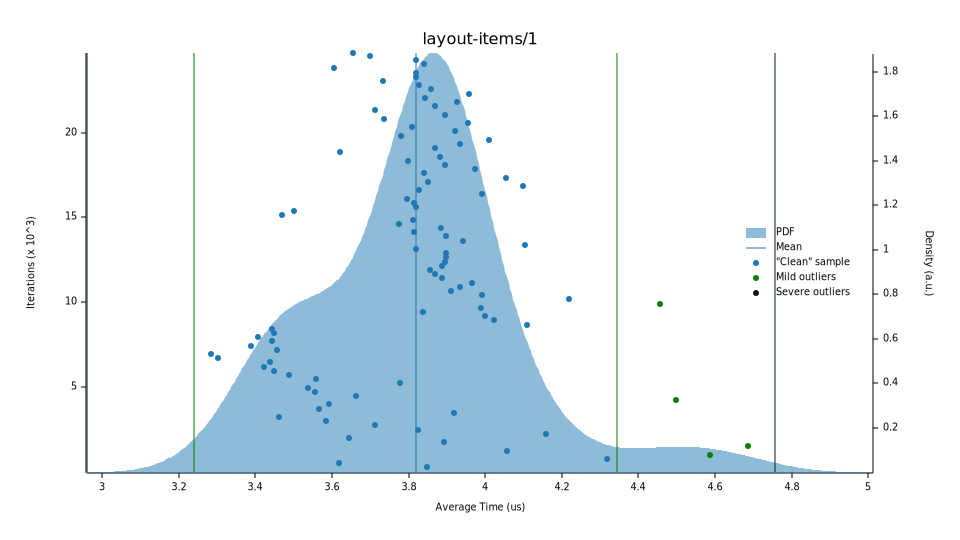
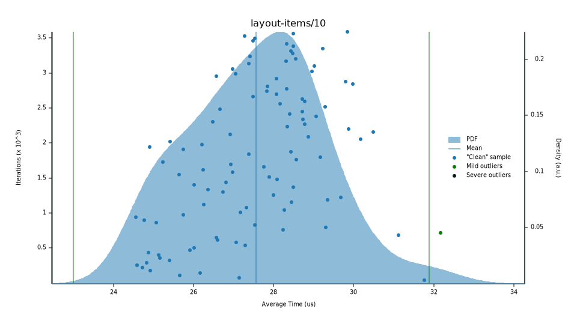
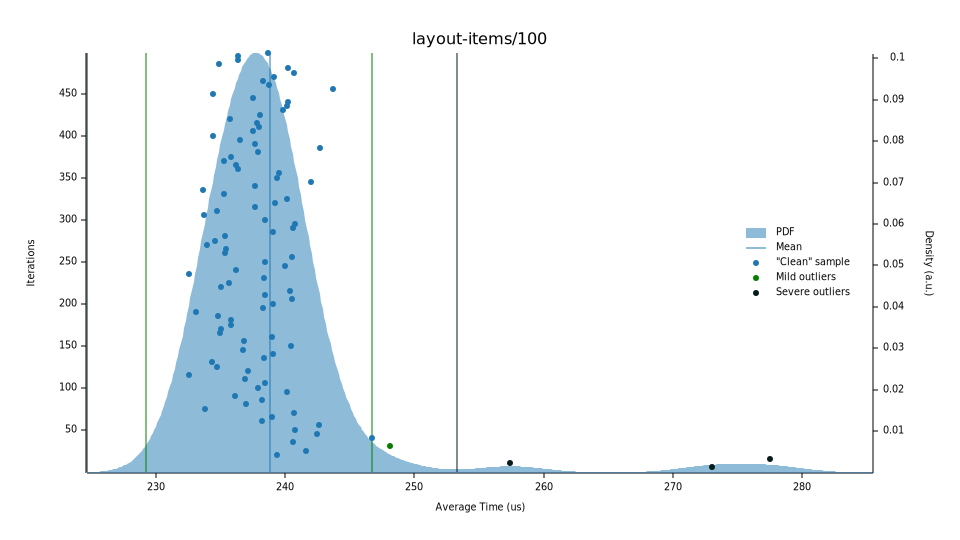
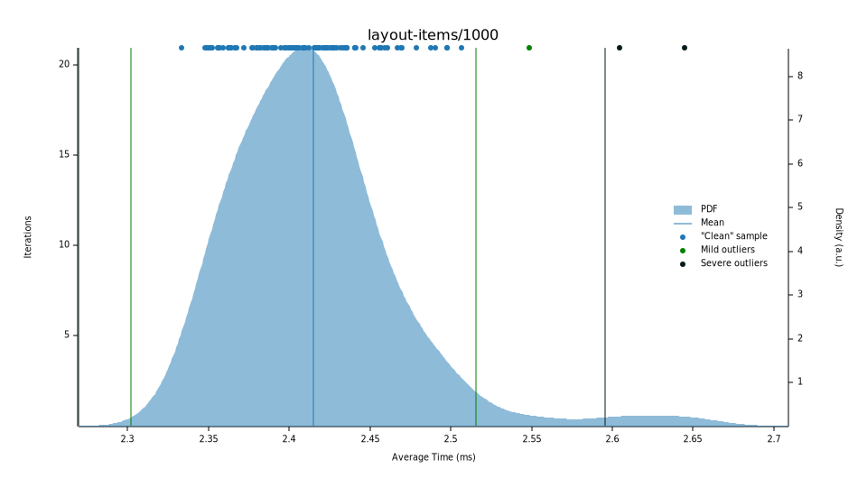
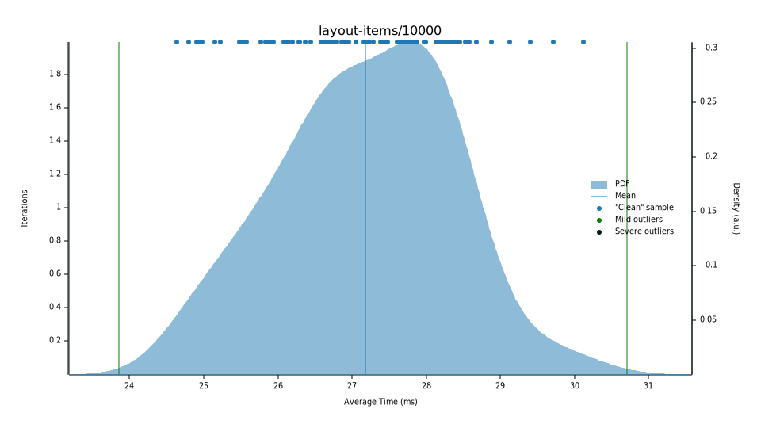
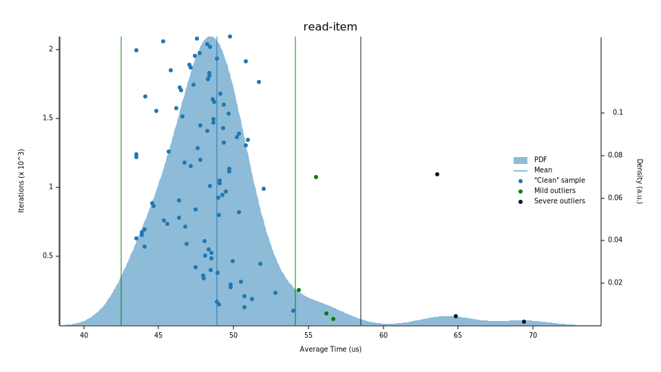
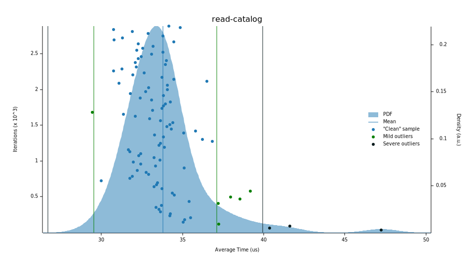
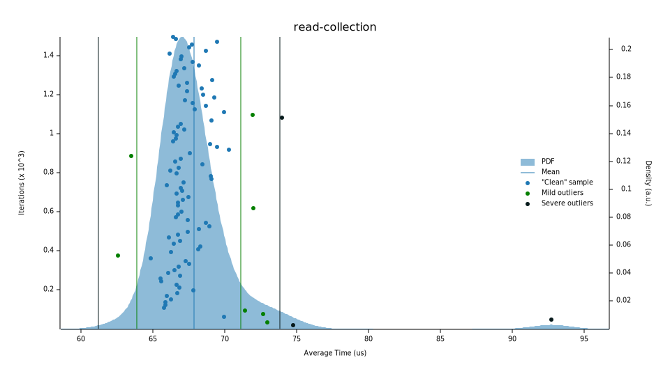

# Benchmarks

We use [criterion](https://docs.rs/criterion/latest/criterion/) for benchmarking.
Per the [user guide's recommendation](https://bheisler.github.io/criterion.rs/book/faq.html#how-should-i-run-criterionrs-benchmarks-in-a-ci-pipeline), we do not run benchmarks via Github Actions.
This repository contains [scripts/bench](./scripts/bench) to run benchmarks and copy their output into [benches/reports](./benches/reports).
To run the benchmarks, you'll need [cargo-criterion](https://github.com/bheisler/cargo-criterion):

```shell
cargo install cargo-criterion
```

Then, run the script:

```shell
scripts/bench
```

To compare your current branch with the last release, use `scripts/bench_compare`.

## Results

These results are from benchmarking runs on @gadomski's laptop.
YMMV.

```text
test layout-items/1 ... bench:        3458 ns/iter (+/- 102)
test layout-items/10 ... bench:       24499 ns/iter (+/- 883)
test layout-items/100 ... bench:      238144 ns/iter (+/- 6251)
test layout-items/1000 ... bench:     2409595 ns/iter (+/- 50627)
test layout-items/10000 ... bench:    28432409 ns/iter (+/- 553579)
test read-item ... bench:             49315 ns/iter (+/- 3489)
test read-collection ... bench:       67264 ns/iter (+/- 3136)
test read-catalog ... bench:          34788 ns/iter (+/- 2085)
```

### Layout

These benchmarks test how long it takes to lay out a `Stac`, i.e. set each object's href and links.


#### 1 item



#### 10 item



#### 100 item



#### 1000 item



#### 10000 item



### Read

These benchmarks test how long it takes to read a STAC JSON from the local filesystem into an `Object`.
It's not surprising there is some variability, since they require filesystem access.

#### Read item

Reading [data/simple-item.json](data/simple-item.json):



#### Read catalog

Reading [data/catalog.json](data/catalog.json):



#### Read collection

Reading [data/collection.json](data/collection.json):


