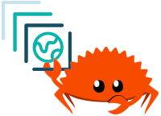

# stac-rs

[](https://github.com/stac-utils/stac-rs/actions/workflows/ci.yml)

[](./CODE_OF_CONDUCT)



Command Line Interface (CLI), Rust crates, and other libraries for the [SpatioTemporal Asset Catalog (STAC)](https://stacspec.org/) specification.

- [stac-cli](./cli/README.md) is a command-line interface to query a STAC API, create and validate STAC items, and do other awesome stuff on the command line.
- [stac](./core/README.md) is the core library with data structures (`Item`, `Catalog`, and `Collection`) and more.
- [stac-api](./api/README.md) contains the data structures for the [STAC API specification](https://github.com/radiantearth/stac-api-spec) and a client for interacting with one.
- [stac-server](./server/README.md) is a STAC API server with multiple backends.
- [stacrs](./python/README.md) is a small, no-dependency Python library based on **stac-rs**.

## Crates

This monorepo contains several crates:

| Crate | Description | Badges |
| ----- | ---- | --------- |
| [stac](./core/README.md) | Core data structures and synchronous I/O | [](https://github.com/stac-utils/stac-rs/actions/workflows/core.yml) <br /> [](https://docs.rs/stac/latest/stac/) <br> [](https://crates.io/crates/stac) |
| [stac-api](./api/README.md) | Data structures for the [STAC API](https://github.com/radiantearth/stac-api-spec) specification | [](https://github.com/stac-utils/stac-rs/actions/workflows/api.yml) <br /> [](https://docs.rs/stac-api/latest/stac_api/) <br> [](https://crates.io/crates/stac-api) |
| [stac-cli](./cli/README.md)| Command line interface | [](https://github.com/stac-utils/stac-rs/actions/workflows/cli.yml) <br /> [](https://docs.rs/stac-cli/latest/stac_cli/) <br> [](https://crates.io/crates/stac-cli) |
| [stac-server](./server/README.md)| STAC API server with multiple backends | [](https://github.com/stac-utils/stac-rs/actions/workflows/server.yml) <br /> [](https://docs.rs/stac-server/latest/stac_server/) <br> [](https://crates.io/crates/stac-server) |
| [stac-validate](./validate/README.md) | Validate STAC data structures with [jsonschema](https://json-schema.org/) | [](https://github.com/stac-utils/stac-rs/actions/workflows/validate.yml) <br /> [](https://docs.rs/stac-validate/latest/stac-validate/) <br> [](https://crates.io/crates/stac-validate) |
| [pgstac](./pgstac/README.md) | Bindings for [pgstac](https://github.com/stac-utils/pgstac) | [](https://github.com/stac-utils/stac-rs/actions/workflows/pgstac.yml) <br /> [](https://docs.rs/pgstac/latest/pgstac/) <br> [](https://crates.io/crates/pgstac) |
| [stac-duckdb](./duckdb/README.md) | Experimental client for [duckdb](https://duckdb.org/) | [](https://github.com/stac-utils/stac-rs/actions/workflows/duckdb.yml) <br /> [](https://docs.rs/stac-duckdb/latest/stac_duckdb/) <br> [](https://crates.io/crates/stac-duckdb) |

## Bindings

### Python

**stacrs** is a small, no-dependency Python library that uses **stac-rs** under the hood.
Install with **pip**:

```shell
pip install stacrs
```

See [the documentation](https://stacrs.readthedocs.io/) for more information.

## Development

See [CONTRIBUTING.md](./CONTRIBUTING.md) for information about contributing to this project.
See [RELEASING.md](./RELEASING.md) for a checklist to use when releasing a new version.

## License

**stac-rs** is dual-licensed under both the MIT license and the Apache license (Version 2.0).
See [LICENSE-APACHE](./LICENSE-APACHE) and [LICENSE-MIT](./LICENSE-MIT) for details.

<!-- markdownlint-disable-file MD033 -->
