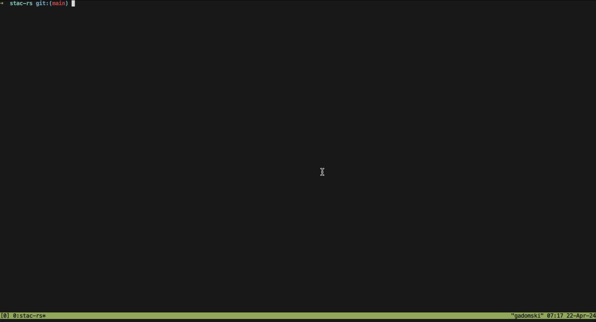

# stac-cli

[](https://github.com/stac-utils/stac-rs/actions/workflows/ci.yml)
[](https://docs.rs/stac-cli/latest/stac_cli/)
[](https://crates.io/crates/stac-cli)

[](./CODE_OF_CONDUCT)

Command Line Interface (CLI), named `stacrs` for [STAC](https://stacspec.org/) built with [stac-rs](https://github.com/stac-utils/stac-rs).



## Installation

Install rust, e.g. with [rustup](https://rustup.rs/).
Then:

```sh
cargo install stac-cli
```

You can also install it from PyPI, where it is named **stacrs**:

```shell
pip install stacrs
```

### Homebrew

If you use [homebrew](https://brew.sh/), you can use [gadomski's](https://github.com/gadomski/) tap to install:

```shell
brew install gadomski/gadomski/stac
```

## Usage

**stacrs** provides the following subcommands:

- `stacrs item`: create STAC items and combine them into item collections
- `stacrs search`: search STAC APIs
- `stacrs serve`: serve a STAC API
- `stacrs sort`: sort the fields of STAC items, catalogs, and collections
- `stacrs translate`: convert STAC values from one format to another
- `stacrs validate`: validate STAC items, catalogs, and collections using [json-schema](https://json-schema.org/)

Use the `--help` flag to see all available options for the CLI and the subcommands:

## Features

By default, the CLI builds w/ [GDAL](https://gdal.org) support, and will error if GDAL is not installed on your system.
If you don't want to use GDAL, you can disable the default features:

```shell
cargo install stac-cli --no-default-features
```

## Other info

This crate is part of the [stac-rs](https://github.com/stac-utils/stac-rs) monorepo, see its README for contributing and license information.
